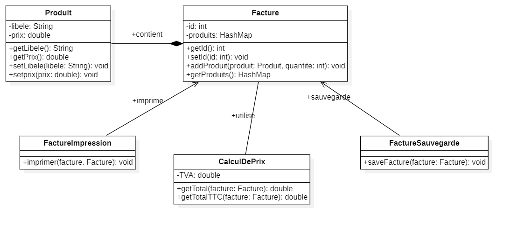

# Exercice 1

## Question 1 : Le principe SOLID non respecté

Le principe SOLID qui n'est pas respecté dans le code est le **principe de responsabilité unique (Single Responsibility Principle - SRP)**

## Question 2 : Diagramme de classe

Voici le diagramme de classe :

Le diagramme de classe reflète une structure plus modulaire et respecte les principes SOLID en séparant les responsabilités des différentes classes.

## Question 3 : Implementation de solution

Voir le package /src/refactoring

## Question 4 : implementation de main

Voir le package /src/refactoring
